# Fields

A simple generative art project revolving around the three.js particle system and the Simplex Noise function.

You can play with the controls provided to make your own rendering and print it at home, or simply watch the shapes evolve.

## Website

[https://fields-seven.vercel.app/](https://fields-seven.vercel.app/)

## Controls

- particles: range [1000, 300000] — Adjusts the number of particles on screen.
- simplex noise scale: range [0.001, 0.3] — Adjusts the scale factor of the simplex noise function. Try variations on very small values to get surprising results.
- size: range[1, 10] — Adjusts the size of a particle.
- invert: bool — Inverts color scheme. From black background and white particles to white background and black particles.
- angle type: enum ['static', '* time', '+ time'] — Adjusts the time have on the simplex noise influence when choosing the angle for a particle movement.
    - `static`: no influence
    - `* time`: multiply by elapsed time
    - `+ time`: sum by elapsed time
- z noise: bool — When enabled, the noise function is being added a third dimension (z) to influence it.
- cos scale: range [1, 10] — Adjusts the force applied to `cos` when pos x of a particle is calculated from the generated angle.
- sin scale: range [1, 10] — Adjusts the force applied to `sin` when pos y of a particle is calculated from the generated angle.

## Print

At the bottom left, you'll find a print button. It simply takes a screenshot, removing all UI elements, and downloads it. Come and share them on twitter!

## Samples

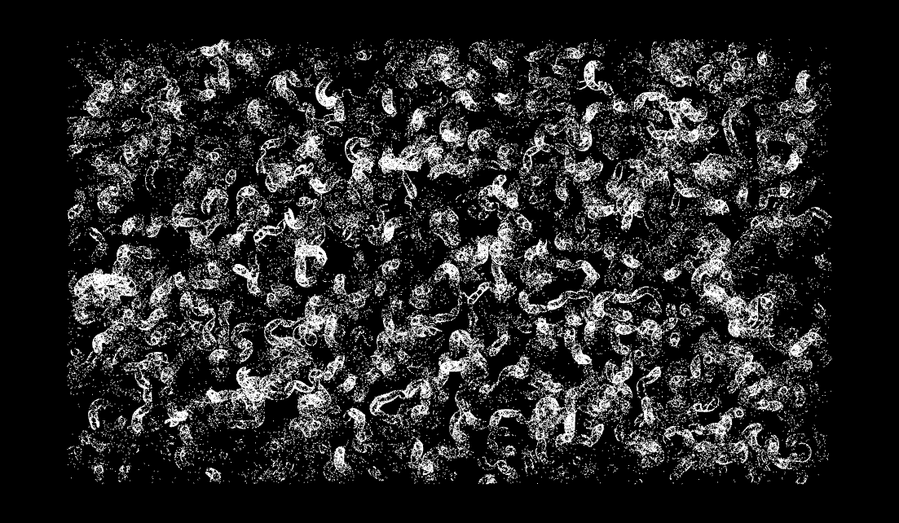
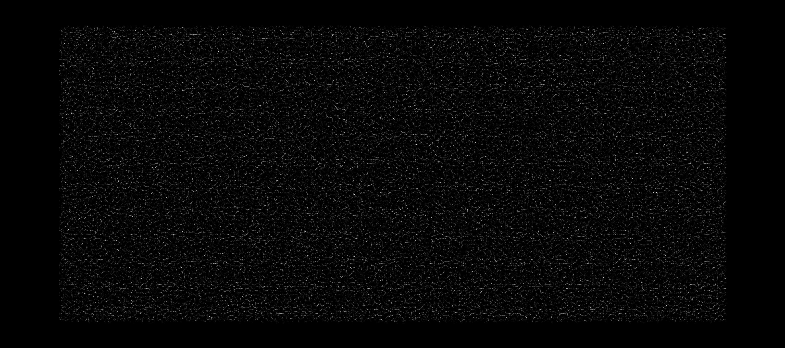
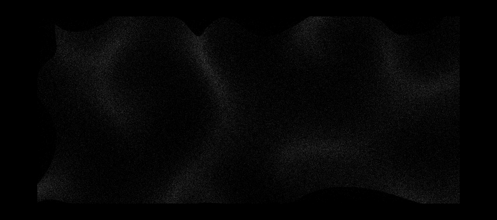
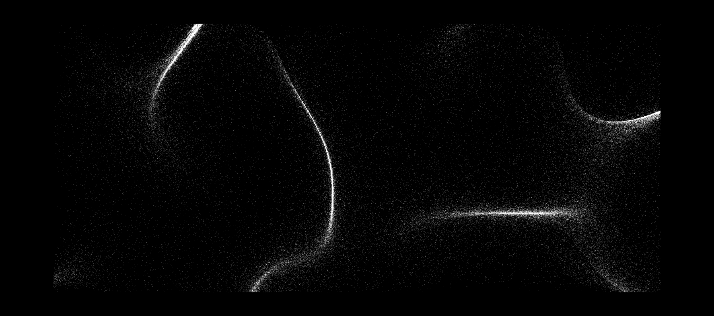
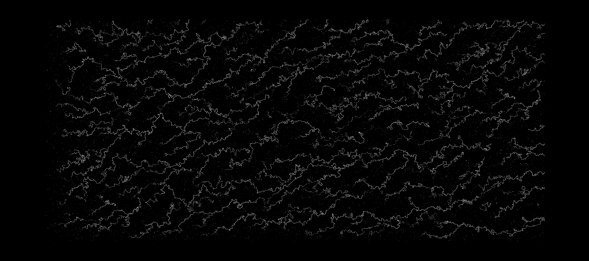
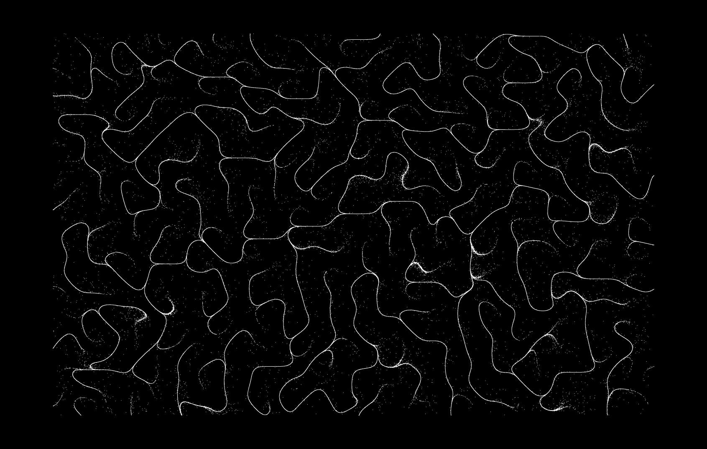
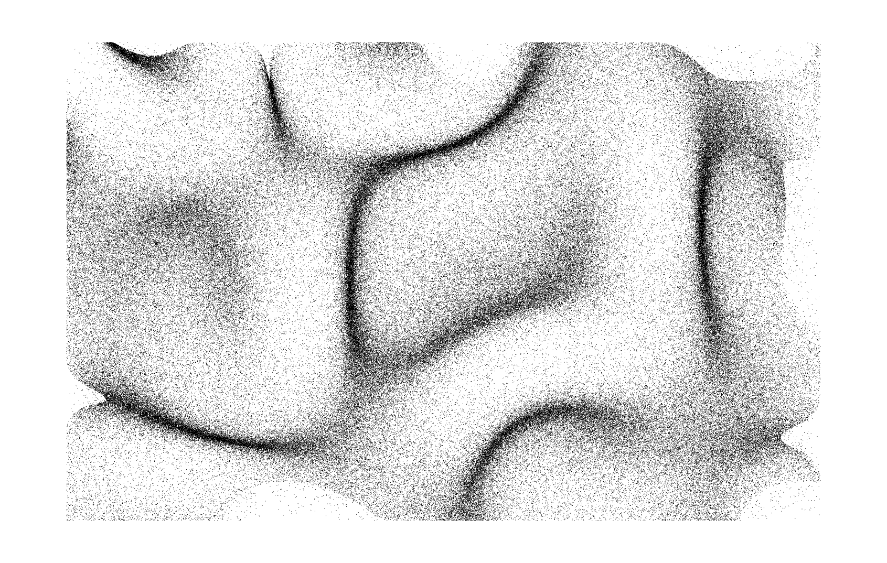
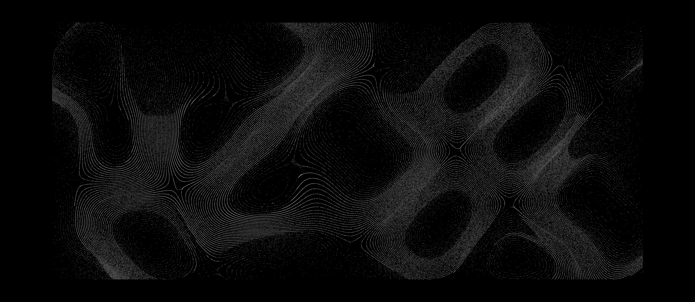

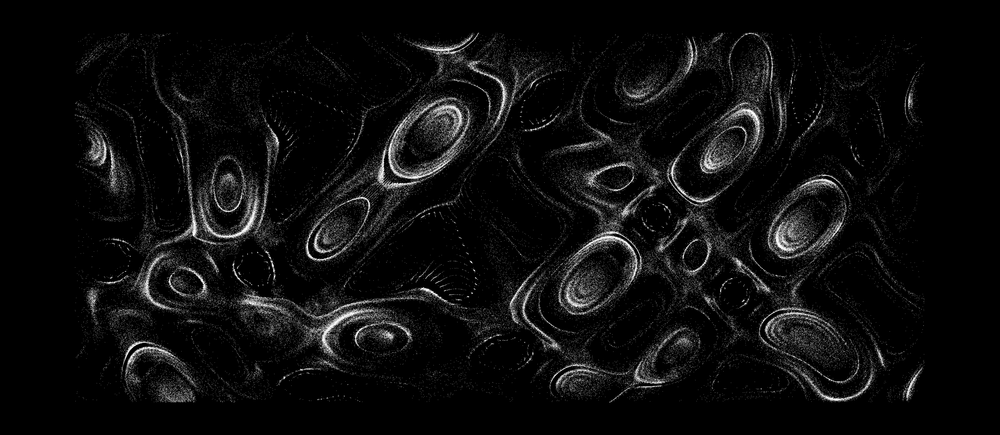
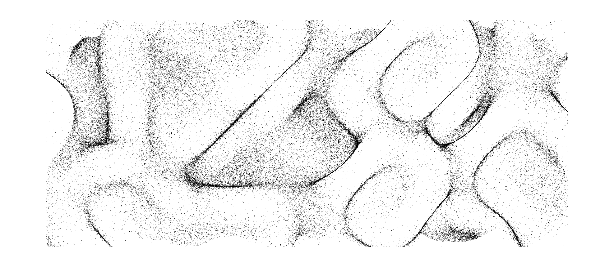
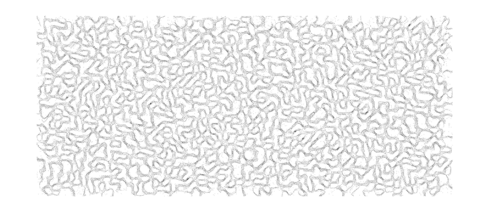
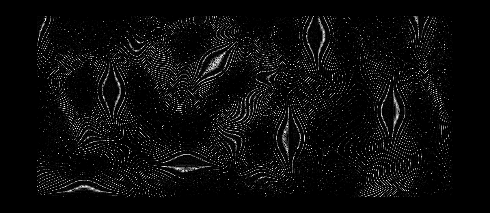
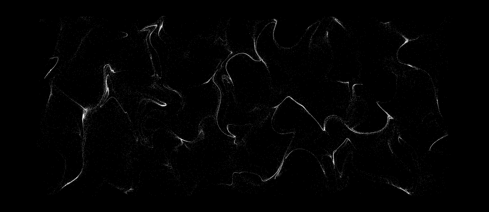
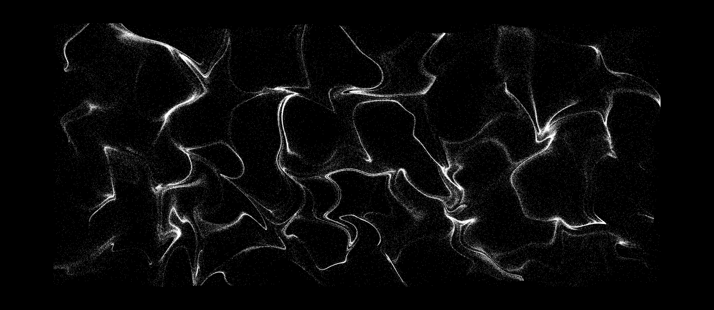
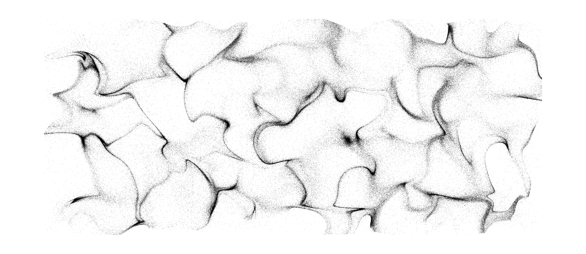
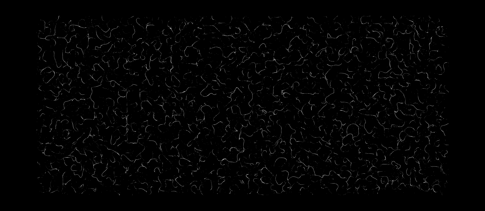
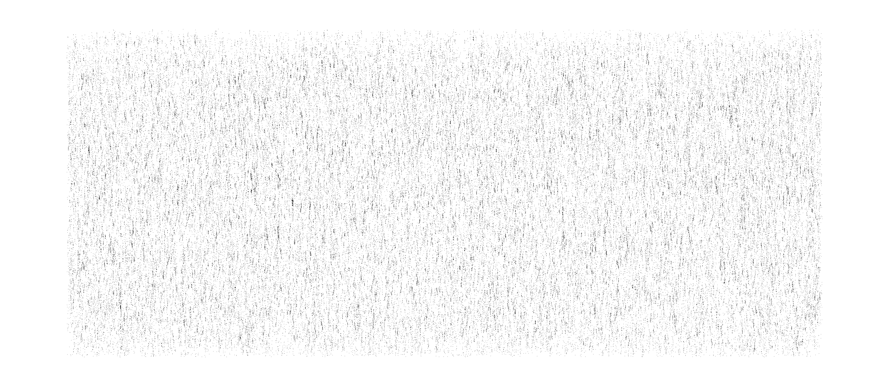

## Setup

``` bash
# Install dependencies (only the first time)
npm install

# Run the local server at localhost:8080
npm run dev

# Build for production in the dist/ directory
npm run build
```
